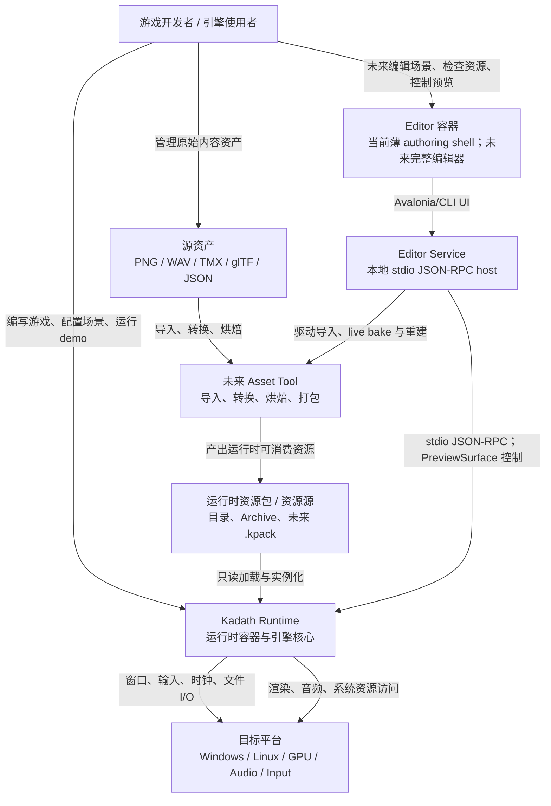

# Kadath C4-Context

## 元信息

- **状态**: 已确认
- **日期**: 2026-06-04
- **主题**: Kadath 的系统上下文图（C4 Level 1）
- **依据**:
  - `ADR-0001`: 语言选型策略
  - `ADR-0005`: 世界模型方向
  - `ADR-0006`: 编辑器与 Runtime 边界
  - `ADR-0007`: 资源加载与资产边界
  - `ADR-0008`: 调度 / 执行模型

---

## 1. 目标

这张图用于回答一个非常基础但必须统一的问题：

- `Kadath` 当前架构中，系统边界到底画在哪里
- 外部参与者是谁
- 外部参与者和引擎核心之间通过什么类型的关系协作

它不进入模块内部实现，也不替代 ADR。它只是把“系统在世界中的位置”固定下来，避免后续讨论时每个人脑中的系统边界都不一样。

---

## 2. 系统上下文图

---

## 3. 读图说明

- 当前系统边界的核心对象是 **Kadath Runtime**，也就是 `M0-M3` 主路径上真正需要先跑起来的那部分。
- **Editor** 和 **Asset Tool** 位于 Runtime 外部；当前已落地的是不持有 Runtime 内部状态的薄 authoring shell，完整 Editor 与 Asset Tool 仍是后续容器。
- **源资产** 与 **运行时资源** 被明确区分：
  - 源资产服务于创作、导入和编辑。
  - 运行时资源服务于 Runtime 的只读加载与实例化。
- `Developer` 当前既可能直接驱动 Runtime，也可能在未来通过 Editor 和 Asset Tool 间接驱动它。

---

## 4. 当前锁定的上下文结论

- `Kadath` 当前的系统中心不是 Editor，而是 Runtime。
- Editor 与 Asset Tool 在架构上是 Runtime 外部协作者，而不是默认内嵌子系统。
- Runtime 与外界的稳定交互边界优先建立在：
  - 平台服务
  - 可序列化场景/配置
  - 运行时资源包 / 资源源
  - 粗粒度控制命令
- Runtime 不直接承担：
  - 完整资产导入与烘焙
  - 编辑器 UI 状态
  - 原始资产创作语义

---

## 5. 一句话结论

Kadath 当前的系统上下文是：**以 Runtime 为中心，Developer 直接或经由未来 Editor / Asset Tool 驱动它；源资产先经过外部工具链处理，再以运行时资源形式进入 Runtime。**
