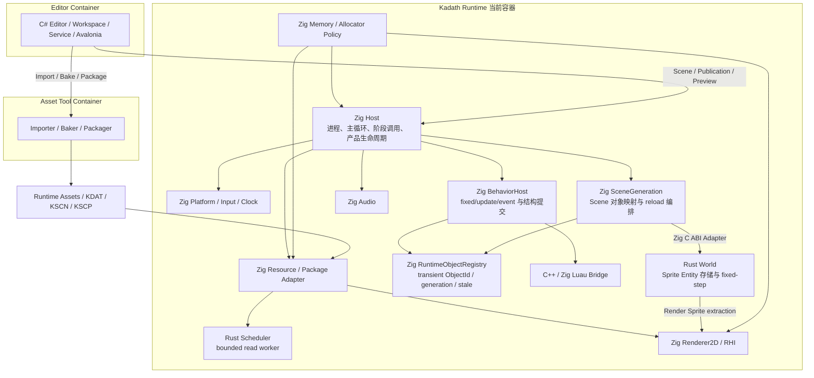
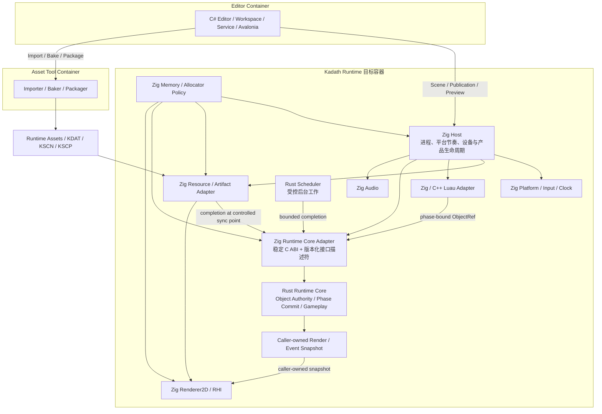

# Kadath C4 Runtime 容器与核心 Module

## 元信息

- **状态**: 已确认；2026-08-22 Phase Commit implementation clarification
- **初始日期**: 2026-06-04
- **更新日期**: 2026-08-22
- **主题**: Kadath Runtime 当前态、目标态与迁移 seam
- **依据**:
  - `ADR-0002`: 构建系统与项目结构
  - `ADR-0004`: RHI 抽象粒度
  - `ADR-0005`: 世界模型方向
  - `ADR-0006`: 编辑器与 Runtime 边界
  - `ADR-0007`: 资源加载与资产边界
  - `ADR-0008`: 调度 / 执行模型
  - `ADR-0009`: Rust / Zig Runtime Ownership 对账

---

## 1. 目标与读图规则

本文同时记录：

- **CURRENT**：截至 `P2-Runtime-Object-Lifecycle-01` candidate `bfc5504` 的实现事实；
- **TARGET**：完成 `ADR-0009` 分阶段迁移后的目标 ownership；
- **MIGRATION**：从 CURRENT 到 TARGET 的固定点顺序。

目标态在对应代码候选合并前不得改写成当前态。图中的语言标签表示 Module 的 authority implementation，不表示调用关系只能发生在同一语言。

---

## 2. CURRENT：`bfc5504` 当前实现

### 2.1 当前职责

- `Zig Host` 已经是实际组合根，拥有 Platform pump、Clock、fixed accumulator、reload/restart 外层事务和产品生命周期；
- `Zig SceneGeneration` 拥有 Scene Object 到 Rust Entity 的映射，并编排 source/artifact generation；
- `Zig BehaviorHost` 拥有双时钟 callback、ObjectRef Adapter、event FIFO、Activation Overlay 和 Structural Flush；
- `Zig RuntimeObjectRegistry` 拥有动态 ObjectId、generation、stale、spawn/despawn reservation 与预算；
- `Rust World` 拥有 Sprite Entity 存储、位置、bounds、fixed-step、spawn/despawn 与 render extraction；
- `Rust Scheduler` 是隔离的异步读取 Module，不拥有主线程 Runtime 推进；
- `Zig Memory / Allocator Policy` 保留原 C4 的底层内存职责；当前实现可以分散使用显式 allocator，不宣称已经存在一个成熟的独立 Memory Module；
- `C# Editor`、Asset Tool pipeline 与 `Luau Behavior` 已是实际产品入口，不再是 Future 组件。

### 2.2 当前架构债务

World 对象语义横跨 `SceneGeneration`、`BehaviorHost`、`RuntimeObjectRegistry` 与 Rust `World`。它们没有直接共享私有容器，但调用方必须理解多个 Module 的顺序、identity 和 failure domain，导致 Object Authority 与 Phase Commit 缺少单一深 Interface。

---

## 3. TARGET：Zig Host + Rust Runtime Core

### 3.1 目标职责

- `Zig Host` 决定 **何时** pump、fixed、update、event、extract 和 render；
- `Rust Runtime Core` 决定阶段内 World 状态 **如何** 变化；
- `Rust Runtime Core` 在自己的单一外部 Interface 后隐藏 Object Authority、Phase Commit、World、Collision 与 Gameplay，图中不暴露这些内部实现之间的调用链；
- Runtime Core 内部的 `Object Authority` 唯一拥有 ObjectId、Entity、generation、source/transient 与 stale；
- Runtime Core 内部的 `Phase Commit` 唯一拥有 mutation、结构请求、事件、预算和 failure domain；
- `World / Collision / Gameplay` 不依赖 Window、RHI、Editor 或 Luau VM layout；
- `Snapshot` 是 Renderer 与事件消费者的只读输出，不允许反向修改 Runtime Core；
- `Zig Runtime Core Adapter` 只做 preflight、类型转换、调用编排和错误映射，不复制 state machine。

---

## 4. Ownership 对照

| 运行时事实 | CURRENT | TARGET | 迁移增量 |
|---|---|---|---|
| 进程、窗口、时钟、fixed accumulator | Zig Host | Zig Host | 不迁移 |
| Memory / allocator policy | Zig 显式 allocator | Zig 显式 allocator | 不迁移 |
| RHI、Renderer、Audio、Resource I/O | Zig | Zig | 不迁移 |
| Scene/KSCN/KSCP 解码 | Zig | Zig Adapter | 不迁移 authority |
| Sprite Entity 存储 | Rust World | Rust Runtime Core | Object Authority |
| ObjectId→Entity 映射 | Zig SceneGeneration | Rust Runtime Core | Object Authority |
| transient ObjectId / generation / stale | Zig Registry | Rust Runtime Core | Object Authority |
| spawn/despawn 生命周期 | Zig Registry + Rust World | Rust Runtime Core | Object Authority |
| Scene candidate Runtime state prepare/commit/abort | Zig Host/SceneGeneration | Rust Runtime Core；Zig Host 保留跨 Module 外层编排 | Object Authority |
| restart Runtime object replacement | Zig Host/SceneGeneration | Rust Runtime Core | Object Authority |
| fixed/frame structure queue | Zig BehaviorHost | Rust Runtime Core | Phase Commit |
| Runtime Object 物理存储上限（128 records） | Zig Registry | Rust Runtime Core | Object Authority |
| Behavior Instance、结构、事件与跨资源 admission（256/64/64） | Zig BehaviorHost/Registry | Rust Runtime Core | Phase Commit；Object Authority 增量期间继续由 Zig `BehaviorHost` 唯一持有 |
| collision/contact | Zig SceneGeneration/Contact | Rust Runtime Core | Gameplay |
| GameSession / demo gameplay | Zig Host/SceneGeneration | Rust Runtime Core | Gameplay |
| Object Authority active read view → 现有 `RenderSprite` 投影 | Rust World + Zig ordering | Rust Runtime Core read view → Zig `SceneGeneration` projection | Object Authority 临时 Adapter seam |
| 最终 Render extraction | Rust World + Zig ordering | Rust render snapshot → Zig Renderer | Gameplay；建立后删除上述 Zig projection |
| Runtime 调用时机 | Zig Host | Zig Host | 不迁移 |
| Editor authoring/read-model | C# | C# | 不迁移 |
| Behavior source | Luau | Luau | 不迁移 |
| Luau native bridge | C++/Zig | C++/Zig Adapter | 不扩张 |
| Importer / Baker / Packager | Editor/Asset Tool pipeline | Runtime 外部 Asset Tool | 不迁入 Runtime Core |

---

## 5. 外部 seam

Rust Runtime Core 通过稳定 C ABI + 版本化接口描述符提供一个深 Interface。具体函数表由 `P1-Rust-Runtime-Core-Object-Authority-01` 冻结，但必须满足：

- opaque handle；
- 不设置构建产物级全局 ABI version；descriptor、callback table 和 snapshot 使用 `struct_size`，只有语义不兼容时才使用各自 `interface_version`；
- size/reserved preflight；
- caller-owned descriptor、batch 与 snapshot buffer；
- count/length/alignment/enum 全量校验；
- Rust panic 不穿越 ABI；
- 错误无未声明部分提交；
- 不暴露 Rust collection、reference、trait object 或 allocator layout；
- 不为每个内部字段建立长期 getter/setter 扇出。

Luau ObjectRef 的同步直接修改语义保持不变。Adapter 可以同步调用 Runtime Core；合法性、stale 和 mutation 规则只能由 Runtime Core 裁决。

---

## 6. MIGRATION 固定点

### 6.1 当前固定点

- `e1a9313`：Behavior 双阶段对象与事件 API 已进入 Inner main；
- `bfc5504`：Runtime Object Lifecycle candidate，作为对象生命周期行为 oracle；
- 当前 C4 的 CURRENT 图以 `bfc5504` 为准，不能将 TARGET 图解释为已经实现。

### 6.2 迁移顺序

1. `P1-Rust-Runtime-Core-Object-Authority-01`：迁移 ObjectId/Entity/generation/lifecycle、Runtime state candidate prepare/commit/abort 与 restart replacement，并删除 Zig Registry authority；
2. `P1-Rust-Runtime-Core-Phase-Commit-01`：迁移 phase queue、结构提交、事件与预算；
3. `P1-Rust-Runtime-Core-Gameplay-01`：迁移 collision/contact、GameSession 与 snapshot authority。

每个增量必须：

- 独立 contract discovery 与 `GO_IMPLEMENT`；
- 使用前一固定点行为作为 oracle；
- 在同一 candidate 删除被替换 authority；
- 通过 Rust/public C/Zig focused 与 Linux 产品矩阵；
- 不以 Linux 证据宣告 Windows 产品验收；
- 不修改 `.scratch/` 或新增 PowerShell 脚本。

### 6.3 2026-08-22 Phase Commit implementation clarification

`P1-Rust-Runtime-Core-Phase-Commit-01` 的 implementation target 已按独立冻结契约登记，但在 candidate 合并前仍属于 TARGET，不改变 `## 2 CURRENT` 图：

- Rust Runtime Core 是 fixed/frame phase queue、event/structural sequence、generation、256 Behavior admission、fixed/frame 各 64 event 与 64 structural budget、flush token、activation transaction 和 same-flush/failure semantics 的唯一 authority；Object Authority v1 保持独立接口。
- Zig Host 继续决定 **何时** begin/dispatch/flush/end，保留 clock、fixed accumulator、phase timing、Luau VM/C++ bridge、callback 执行、ActiveSet、callback staging、diagnostic、collision/contact observer、gameplay 与 render projection；Zig Runtime Core Adapter 不复制 Rust state machine。
- Phase Interface v1 使用 versioned descriptor + opaque Core + bounded caller-owned POD batch；不得出现 VM/bridge pointer、Gameplay、Renderer、Window、Editor 或 scheduler 类型。`drain_events`/`take_structural` 每次一个最低 generation bucket，Host 外层循环至 queue/token 清空。
- 同一实现 candidate 必须删除 Zig persistent phase queue/admission/sequence/generation writer；callback-local staging 可保留。Scene/KSCN/KSCP、Luau Host v4、Editor/Preview/Package wire、collision/gameplay migration、final render snapshot 和 Scheduler 不在本增量内。
- 该 clarification 对应 Outer contract discovery `P1-Rust-Runtime-Core-Phase-Commit-01`，Inner baseline `444dc5b`；Linux 证据仍不代理 Windows/NTFS/HWND/Vulkan acceptance。

### 6.4 2026-08-25 Gameplay implementation clarification

`P1-Rust-Runtime-Core-Gameplay-01` 在 Object Authority 与 Phase Commit 已交付的同一 opaque Core 上完成最后一个 authority cluster；本节记录 implementation candidate 的目标态，在合并前不反写 `## 2 CURRENT`：

- Rust Runtime Core 唯一拥有 `Playing/Won/Lost`、timer、terminal cause、outcome sequence high-water、Player↔source Goal/Hazard strict-AABB contact ledger、legacy patrol movement、Player final tint 与 coherent render/gameplay snapshot；Zig 不保存跨 step 的 Gameplay/contact/outcome mirror。
- Scene publication 固定为 Object prepare → Gameplay prepare → Phase prepare/ready → Object commit。Object、Gameplay、Phase 任一 candidate 缺失或 Phase 未 ready 时拒绝，成功时一次发布；restart 仅允许从 terminal live state进入，并保留 step/outcome high-water，Scene reload 递增 epoch 且清空 contact。
- Zig Host 仍决定 fixed/frame 时机、Luau callback dispatch、structural settle、Renderer、Audio 与日志消费；Rust 不依赖 Luau VM、Window、RHI、Renderer、Audio、Editor 或 package wire。
- `begin_fixed_step`先裁决timer并返回capacity-1 one-shot outcome；`commit_fixed_step`在World movement后计算contact，按 source order 生成全部 end 后全部 begin 的Phase event，并在Phase容量预检后原子发布Gameplay plan。Hazard在Goal之前裁决，edge-touch与transient不参与contact。
- Render publication只消费Rust caller-owned bounded snapshot。`SceneGeneration`在堆上拥有已解码Scene并以指针传递，避免固定容量Scene在Windows调用链上形成大型按值栈副本；KSCN schema、wire和容量不变。
- 同一candidate删除 Zig `GameSession`、collision/contact ledger和final gameplay projection；`app/game.zig`、`app/collision.zig`不再作为生产authority存在。Linux quality/product证据与Windows HWND/Vulkan/NTFS验收仍分别记录，任何缺失不得提升为PASS。

---

## 7. Scheduler 与后台工作

`Scheduler` 与 Runtime phase authority 仍是不同 Module：

- Host 选择 completion ingestion 同步点；
- Runtime Core 决定 completion 如何影响 World state；
- Scheduler worker 不直接持有 World、Renderer、RHI 或 Editor state；
- 没有第二个真实消费者前，不扩张为线程池、task graph 或 async runtime。

---

## 8. 结构结论

1. CURRENT 是 Zig 高层 orchestration + Rust Sprite World 的分裂 ownership；它是迁移起点，不是目标架构；
2. TARGET 是 Zig Host + Rust Runtime Core，Host 拥有 timing，Core 拥有 state transition；
3. Editor、Luau 和 Renderer 只通过 Adapter/snapshot 接近 Runtime Core；
4. 迁移采用替换而不是叠层，同一事实禁止双 authority；
5. 架构验收基于 ownership、Interface Depth、旧状态删除和产品等价，不基于语言行数。

---

## 9. 一句话结论

Kadath 当前以 Zig Host/Scene/Behavior 编排 Rust Sprite World；目标是在保留 Zig 平台与产品优势的同时，用版本化 coarse C ABI 将 Object Authority、Phase Commit 和 Gameplay 逐步收敛到 Rust Runtime Core，并在每个固定点删除对应 Zig authority。
