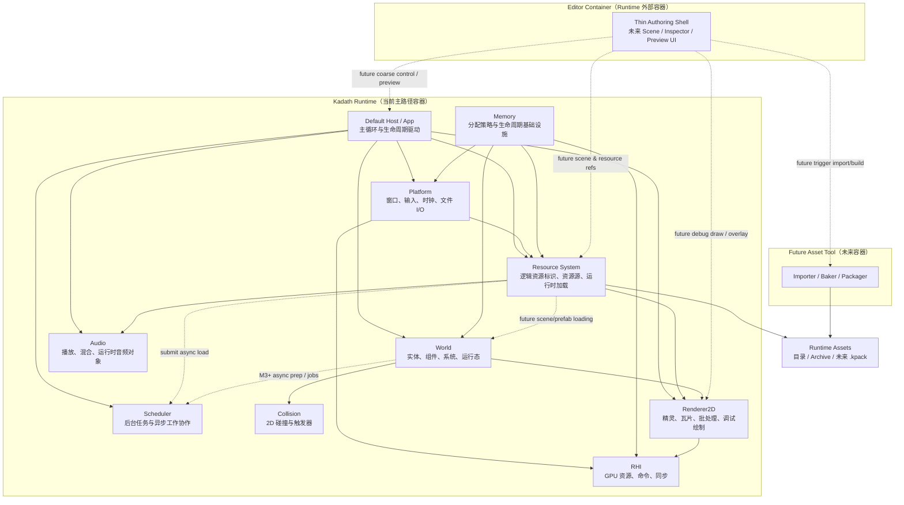

# Kadath C4 容器与核心组件图

## 元信息

- **状态**: 已确认
- **日期**: 2026-06-04
- **主题**: Kadath 的轻量容器 / 组件合并图
- **依据**:
  - `ADR-0002`: 构建系统与项目结构
  - `ADR-0004`: RHI 抽象粒度
  - `ADR-0005`: 世界模型方向
  - `ADR-0006`: 编辑器与 Runtime 边界
  - `ADR-0007`: 资源加载与资产边界
  - `ADR-0008`: 调度 / 执行模型

---

## 1. 目标

这张图采用比标准 C4 更轻的表达方式，把：

- 物理容器边界
- Runtime 内部核心组件关系

合并在一张图里，服务于当前 `M0-M3` 阶段的工程讨论。

它的重点不是穷举未来所有模块，而是固定：

- Runtime 作为单一可执行入口时，内部的主要职责如何分层
- Future Editor 与 Future Asset Tool 在物理上与 Runtime 如何相邻
- 哪些组件处在主路径上，哪些组件是后续增强位点

---

## 2. 容器与核心组件图

---

## 3. 读图说明

### 3.1 Runtime 是当前唯一主路径容器

当前真正先落地的物理容器是 `Kadath Runtime`。

它内部最重要的驱动关系是：

- `Host` 负责生命周期和帧推进
- `World` 负责运行态语义
- `Renderer2D` 与 `Audio` 负责主要输出
- `Resource` 负责把逻辑资源引用解析成可消费运行时对象
- `Platform` 是 Runtime 内部对外部目标平台的适配层，对接 `C4-Context` 中的窗口、输入、时钟、文件 I/O、GPU 与音频设备等平台能力
- `RHI` 只提供图形底层抽象，不吸收高层渲染和编辑器职责

### 3.2 `Host` 是默认宿主，而不是业务核心

`Host` 对应 `ADR-0006` 与 `ADR-0008` 中的“默认宿主”概念：

- 它驱动主循环、阶段切分和外层生命周期
- 它不是世界逻辑、资源导入或渲染策略本身
- Future Editor 若要接管 Runtime，本质上是替换或包裹这一层宿主职责

### 3.3 `Scheduler` 与执行模型不是一回事

图中单列 `Scheduler`，是为了强调：

- 它承担后台任务执行与异步工作协作基础设施
- `Resource` 是最先、最自然会向它提交后台加载工作的组件
- `World` 若未来出现后台准备或批处理任务，也应通过受控任务提交接近它
- 但它不等于主线程上的 Runtime 权威推进顺序

换句话说：

- `ADR-0008` 锁的是 `Host` 如何推进 Runtime
- `Scheduler` 只是在 `M3+` 之后开始帮助处理异步工作

### 3.4 `Resource` 是 Runtime 与工具链的汇合边界

`Resource System` 当前既面向 Runtime，也面向未来 `Asset Tool` 的产物。

它承担的核心职责是：

- 管理逻辑资源身份
- 对接资源源 / 运行时资源包
- 实例化纹理、音频、场景相关运行时对象

它不承担：

- 完整 importer / baker 语义
- 编辑器资产管理 UI
- 底层 GPU 提交

### 3.5 Editor（当前薄 authoring shell）与 Future Asset Tool 是外部容器

它们都在图上出现，但被明确放在 Runtime 外部：

- 当前薄 authoring shell 已通过 Authoring CLI 和 Preview Protocol 以粗粒度方式接近 Runtime；未来完整 Editor 可继续扩展场景 / 资源引用与调试绘制协作
- `Future Asset Tool` 未来负责导入、烘焙、打包，再把运行时产物交给 `Resource System`

这样既保留了扩展路径，也不会污染当前主路径。

---

## 4. 当前锁定的结构结论

- `Host -> World / Resource / Renderer2D / Audio` 是当前最重要的主路径骨架。
- `Platform -> RHI` 是图形和窗口的底层桥接路径。
- `Resource` 是 Runtime 与未来工具链之间最关键的稳定边界之一。
- `World` 与 `Renderer2D` 协作，但 `Renderer2D` 不反向支配世界更新语义。
- 当前薄 authoring shell、未来完整 Editor 和 `Future Asset Tool` 都有清晰接入位点，但 GUI 不改变 Runtime 核心职责。

---

## 5. 一句话结论

Kadath 当前的轻量容器 / 组件结构是：**以 `Host` 驱动 Runtime 主循环，以 `World + Resource + Renderer2D + Audio` 组成主路径，以 `Platform + RHI + Memory` 提供底层支撑，并为当前薄 authoring shell、未来完整 Editor 与 Asset Tool 预留外部接入边界。**
