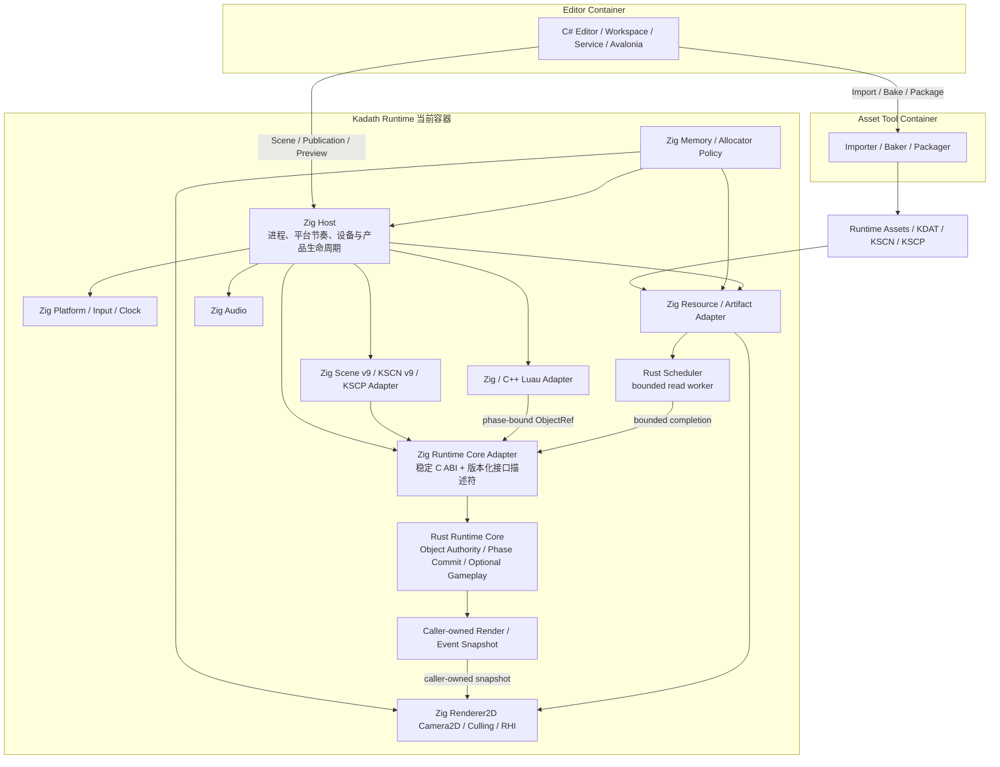
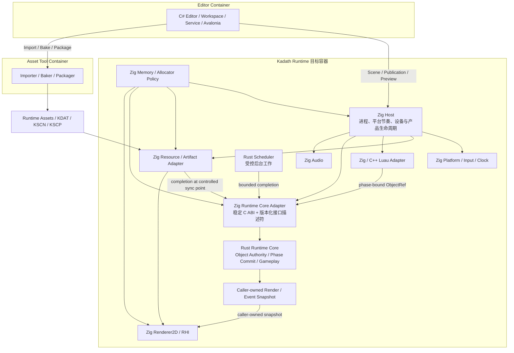

# Kadath C4 Runtime 容器与核心 Module

## 元信息

- **状态**: 已确认；2026-08-28 Camera2D / Culling 候选实现收口
- **初始日期**: 2026-06-04
- **更新日期**: 2026-08-28
- **主题**: Kadath Runtime 当前态、目标态与迁移 seam
- **依据**:
  - `ADR-0002`: 构建系统与项目结构
  - `ADR-0004`: RHI 抽象粒度
  - `ADR-0005`: 世界模型方向
  - `ADR-0006`: 编辑器与 Runtime 边界
  - `ADR-0007`: 资源加载与资产边界
  - `ADR-0008`: 调度 / 执行模型
  - `ADR-0009`: Rust / Zig Runtime Ownership 对账

---

## 1. 目标与读图规则

本文同时记录：

- **CURRENT**：截至 `codex/p1-renderer2d-camera2d-culling-01` 候选分支的实现事实；
- **TARGET**：`ADR-0009` 冻结的长期 ownership 边界；当前三个迁移增量已经达到该边界；
- **MIGRATION**：从历史基线 `bfc5504` 到当前固定点的已完成迁移记录。

图中的语言标签表示 Module 的 authority implementation，不表示调用关系只能发生在同一语言。历史章节中的 TARGET 措辞只描述候选合并前的状态；当前应以 Camera2D 候选分支及本文 CURRENT 为准。

---

## 2. CURRENT：Camera2D / Culling 候选实现

### 2.1 当前职责

- `Zig Host` 是实际组合根，拥有 Platform pump、Clock、fixed accumulator、阶段调用时机、reload/restart 外层事务和产品生命周期；
- `Zig Scene/Behavior Adapter` 负责 Scene/KSCN/KSCP 解码、Luau VM callback、caller-owned POD 转换、调用编排和错误映射，不保存跨 step 的对象、阶段或 Gameplay authority；
- `Rust Runtime Core` 通过同一 opaque Core 后的 versioned Object、Phase 与 Gameplay Interface，唯一拥有 ObjectId/Entity/generation/stale、对象生命周期、阶段队列/预算以及启用时的 collision/contact、GameSession、outcome；Gameplay candidate 明确区分未准备、中立和 `goal_hazard_v1`；
- `Renderer2D` 先消费 Scene 的静态 Tilemap，再消费 Runtime Core 的 caller-owned snapshot，并在内部完成 Camera2D 变换、Tilemap 行列裁剪与 Sprite AABB 裁剪；Audio 与日志只消费 outcome，三者均不反向写入 Core 状态；
- `Rust Scheduler` 是隔离的异步读取 Module，不拥有主线程 Runtime 推进；
- `Zig Memory / Allocator Policy` 保留原 C4 的底层内存职责；当前实现可以分散使用显式 allocator，不宣称已经存在一个成熟的独立 Memory Module；
- `C# Editor`、Asset Tool pipeline 与 `Luau Behavior` 已是实际产品入口；Editor 可读取、编辑、字节级 Undo/Redo、烘焙和预览 Scene v9 Camera/Tilemap，并兼容 Scene v4—v8。

### 2.2 迁移收口判断

历史 `bfc5504` 中横跨 `SceneGeneration`、`BehaviorHost`、`RuntimeObjectRegistry` 与 Rust `World` 的 authority 已被替换：旧 Zig Registry、persistent Phase queue、`GameSession`、collision/contact ledger 和 final gameplay projection 均已删除。当前没有第二份跨 step authority；保留在 Zig 的 callback-local staging、调用时机、Renderer/Audio 消费和 replay recorder 都属于 Adapter 或产品编排。

### 2.3 CURRENT 剩余 Zig 状态清单

以下清单按 Module / Interface ownership 记录 Zig 中仍然存在的状态，而不是按文件或代码量计数。“跨 step”只说明存储寿命，不等于它拥有 Runtime Gameplay authority；只读 publication、设备句柄和 Luau VM 私有状态即使跨 step，也不能成为 Object/Phase/Gameplay 的第二权威。

| 状态 | 生命周期 | 当前权威 | 是否跨 step | 迁移结论 |
|---|---|---|---|---|
| Host 时序与泵状态：clock、`last_time_seconds`、fixed accumulator、frame/heartbeat counter、quit flag | Runtime 进程 / frame loop | Zig Host | 是 | **保留 Zig**。它决定何时推进 Core，不决定 Core 内状态如何变化。 |
| Platform 窗口、设备、键位 held/pressed edge、reload requestId | 进程 / 窗口 / 两次 event pump 之间 | Zig Platform | 是 | **保留 Zig**。Platform state 不进入 Runtime Core；每帧只向 Host 发布 caller-owned `InputSnapshot` / command。 |
| Scene Document、Camera2D、显式 Gameplay Profile、artifact 路径、Script Program 与纹理注册表 | 项目打开至 reload / Runtime 进程 | Zig Host、Resource 与 Scene Adapter | 是 | **不迁移 authoring / I/O authority**。Camera 是只读展示配置，Profile 是已解码配置；二者都不是 Core mirror。成功 reload 只在受控 seam 发布完整候选。 |
| `SceneGeneration` 的 `target`、`extent`、可选 Player/Goal source index 和 `phase_candidate_ready` | 单个 Scene Generation / candidate transaction | Zig Scene Adapter；对象和可选 Gameplay 当代事实仍由 Rust Core 拥有 | 是；candidate-ready 只跨事务调用，不跨已完成 step | **保留 Adapter 投影**。索引只为启用的兼容 Gameplay 构造 descriptor；Neutral 不伪造角色。这些字段不得扩张为对象位置、生命周期、contact 或 session mirror。 |
| Behavior `Package`、`ActiveSet`、Luau VM / coroutine / binding 私有状态 | Script package / Scene Generation | Zig/C++ Luau Adapter 与 Luau VM | 是 | **保留 Zig/C++**。这是 Behavior Instance 的执行状态，不是 Runtime Object/Phase/Gameplay authority；Rust Core 不拥有 VM layout。 |
| `active_phase`（domain + sequence） | 一次 fixed/frame Phase begin→end | Zig Behavior Adapter 的调用游标；队列、generation 与预算在 Rust Core | 否；成功 step/frame 结束必须清空 | **保留薄游标**。不得增加持久 queue、admission 或 sequence writer。 |
| callback-local origin/context、Translation/Event/Structural staging | 单次 callback、drain 或 structural flush | Zig Behavior Adapter | 否 | **保留 Zig**。只借用 caller-owned POD 并在同步 seam 提交；不得跨 step 保存 Core state。 |
| `render_sprites` / `render_count` 与 Renderer2D instance staging | snapshot extract→同帧 render | Rust Core 是 snapshot 内容权威；Zig Host/Renderer 是只读消费者 | 否；buffer 可复用但内容每次 publication 覆盖 | **不迁移**。保持 caller-owned bounded snapshot，禁止反向写回 Core。 |
| RHI / Vulkan / Renderer pipeline、swapchain、GPU resource、frame token | 设备 / swapchain / frame | Zig RHI 与 Renderer2D | 是 | **保留 Zig**。属于设备状态，不是 Gameplay state。 |
| Resource async loader、pending job、completion 与 texture refresh candidate | 单次 I/O job 至受控 completion ingestion | Zig Resource；后台执行由独立 Rust Scheduler 拥有 | 可以 | **不迁入 Runtime Core**。Host 选择 ingestion 时机，只有完成后的有界结果可穿过 seam。 |
| Audio backend、worker、cue queue 与 owned clip | Runtime 进程 / Audio worker | Zig Audio | 是 | **保留 Zig**。只消费 one-shot Outcome，不拥有 outcome sequence 或 GameSession。 |
| replay recorder、digest、allocation/profile 归因表 | 单次测试 / benchmark workload | Zig evidence Adapter + quality-only Rust counter | 可以；仅证据路径 | **永不成为生产权威**。后续能力复用现有 focused evidence，不建设第二套 lifecycle driver。 |

迁移结论：剩余 Zig 状态均属于 Host timing、外部设备/I/O、Authoring/VM 专属状态、caller-owned publication 或 phase/callback 薄游标。当前没有新的跨 step Object、Phase 或 Gameplay authority 需要迁移；后续只有发现同一 Runtime 事实被两个 Module 持久写入时，才重开 ownership 迁移。

### 2.4 已交付能力：Gameplay-neutral Scene

Runtime ownership 迁移完成后，Scene 曾继续强制一个 Player、一个 Goal 和至少一个 Hazard。`P1-Engine-Scene-Neutral-01` 已解除这项 Demo 形状限制：

- Scene v7 缺省 `gameplay` 即为 Neutral；显式 `goal_hazard_v1` 才启用 Demo Gameplay；
- Neutral Scene 继续使用 Rust Runtime Core 的 Object Authority 与 Phase Commit，但不创建或推进 GameSession；
- 旧 Scene v4—v6 通过 Scene Adapter 归一化为兼容 `goal_hazard_v1` Gameplay Profile，产品行为不变；
- Zig Host 只根据已解码 profile 选择调用顺序；Neutral fixed-step 执行 Behavior/Phase settle/end，不调用 Gameplay begin/commit、Outcome 或 Audio；
- Render publication 复用 Object Authority `ACTIVE_OBJECTS` 的同一 ordered read view，经 Zig Adapter 写入 caller-owned `RenderSnapshot`，没有新增第二套 C Interface、缓存或排序权威；
- C# Editor/Workspace 已贯通 v9 投影、通用 Object/Prototype/Tilemap/Camera authoring、字节级 Undo/Redo、KSCN v9 Bake、Live Bake Preview 与真实产品 fixture。

### 2.5 静态 Tilemap 渲染边界

- Scene v8 以最多一个 32×32 row-major Tilemap 保存静态背景；Cell `0` 为空，非零值是一基 Atlas 索引；
- Atlas Texture 必须声明 `pixel_art`，旧 Scene v4—v7 归一为空 Tilemap与原有平滑采样；
- Host 只把已验证的 Cell slice 与 TextureHandle 借给 `Renderer2D.renderFrame`；Renderer 隐藏 UV 展开、零 Cell 跳过和每 128 instance 分块；
- RHI 仍只接收 48-byte opaque Quad instance，不理解 Tilemap、Atlas 或 Scene 类型；per-binding 为 6144 bytes，per-frame 为 65536 bytes；
- Tilemap 不进入 Runtime Object、Behavior、Gameplay、collision/contact、spawn/destroy 或 Rust Core snapshot authority。

### 2.6 Camera2D 与可见性裁剪边界

- Scene v9 顶层保存有限 `origin f32[2]` 与 `zoom f32`；v4—v8 归一为恒等 Camera，KSCN v9 只在 v8 Tilemap 尾部追加 12 字节；
- Host 不维护动态 Camera state，只把活动 Scene 的值借给 `Frame2D.view`；reload/restart 继续使用完整 Scene 事务；
- Renderer2D 以 `screen=(world-origin)*zoom` 计算 NDC，在内部生成可见世界矩形、Tilemap 行列范围与 Sprite 半开 AABB；可见项保持原 row-major/source order；
- 被裁剪 Sprite 不形成纹理 run；所有 Camera、Sprite、Tilemap 输入仍在 `beginFrame` 前完整校验；
- RHI 仅提供通用 opaque TextureHandle 生命周期预检，48-byte instance、Rust Runtime Core 与公共 C ABI 均未增加 Camera 类型或状态。

---

## 3. TARGET：Zig Host + Rust Runtime Core（已达成）

### 3.1 目标职责

- `Zig Host` 决定 **何时** pump、fixed、update、event、extract 和 render；
- `Rust Runtime Core` 决定阶段内 World 状态 **如何** 变化；
- `Rust Runtime Core` 在自己的单一外部 Interface 后隐藏 Object Authority、Phase Commit、World、Collision 与 Gameplay，图中不暴露这些内部实现之间的调用链；
- Runtime Core 内部的 `Object Authority` 唯一拥有 ObjectId、Entity、generation、source/transient 与 stale；
- Runtime Core 内部的 `Phase Commit` 唯一拥有 mutation、结构请求、事件、预算和 failure domain；
- `World / Collision / Gameplay` 不依赖 Window、RHI、Editor 或 Luau VM layout；
- `Snapshot` 是 Renderer 与事件消费者的只读输出，不允许反向修改 Runtime Core；
- `Zig Runtime Core Adapter` 只做 preflight、类型转换、调用编排和错误映射，不复制 state machine。

---

## 4. Ownership 对照

| 运行时事实 | CURRENT | TARGET | 迁移增量 |
|---|---|---|---|
| 进程、窗口、时钟、fixed accumulator | Zig Host | Zig Host | 不迁移 |
| Memory / allocator policy | Zig 显式 allocator | Zig 显式 allocator | 不迁移 |
| RHI、Renderer、Audio、Resource I/O | Zig | Zig | 不迁移 |
| Scene/KSCN/KSCP 解码 | Zig | Zig Adapter | 不迁移 authority |
| Sprite Entity 存储 | Rust Runtime Core | Rust Runtime Core | Object Authority 已完成（`444dc5b`） |
| ObjectId→Entity 映射 | Rust Runtime Core | Rust Runtime Core | Object Authority 已完成（`444dc5b`） |
| transient ObjectId / generation / stale | Rust Runtime Core | Rust Runtime Core | Object Authority 已完成（`444dc5b`） |
| spawn/despawn 生命周期 | Rust Runtime Core | Rust Runtime Core | Object Authority 已完成（`444dc5b`） |
| Scene candidate Runtime state prepare/commit/abort | Rust Runtime Core；Gameplay candidate 可为 PreparedNone 或 PreparedGoalHazard；Zig Host 保留跨 Module 外层编排 | 同 CURRENT | Object/Phase/Gameplay paired transaction 与 Neutral candidate 已完成 |
| restart Runtime object replacement | Rust Runtime Core | Rust Runtime Core | Object Authority 已完成（`444dc5b`） |
| fixed/frame structure queue | Rust Runtime Core | Rust Runtime Core | Phase Commit 已完成（`f114d75`） |
| Runtime Object 物理存储上限（128 records） | Rust Runtime Core | Rust Runtime Core | Object Authority 已完成（`444dc5b`） |
| Behavior Instance admission、结构与事件预算（256/64/64） | Rust Runtime Core | Rust Runtime Core | Phase Commit 已完成（`f114d75`） |
| collision/contact | Rust Runtime Core | Rust Runtime Core | Gameplay 已完成（`3c4edb7`） |
| GameSession / demo gameplay | Rust Runtime Core；Scene v7 可显式不创建 | Rust Runtime Core | Gameplay 已完成（`3c4edb7`），Neutral candidate 已完成（`b3073b6`） |
| Runtime active read view | Rust Runtime Core caller-owned ordered read view | Rust Runtime Core caller-owned ordered read view | Gameplay 与 Neutral 共用 Object Authority；Zig 不保存投影 authority |
| 最终 Render extraction | Gameplay 使用 coherent render snapshot；Neutral 从同一 Object Authority ordered read view 适配为 caller-owned `RenderSnapshot` → Zig Renderer | 同 CURRENT | Gameplay 已完成（`3c4edb7`）；Neutral 复用路径已完成（`f3109b0`） |
| Runtime 调用时机 | Zig Host | Zig Host | 不迁移 |
| Editor authoring/read-model | C# | C# | 不迁移 |
| Behavior source | Luau | Luau | 不迁移 |
| Luau native bridge | C++/Zig | C++/Zig Adapter | 不扩张 |
| Importer / Baker / Packager | Editor/Asset Tool pipeline | Runtime 外部 Asset Tool | 不迁入 Runtime Core |

---

## 5. 外部 seam

Rust Runtime Core 通过稳定 C ABI + 版本化接口描述符提供一个深 Interface。Object、Phase 与 Gameplay 函数表已经由三个独立冻结契约实现，并持续满足：

- opaque handle；
- 不设置构建产物级全局 ABI version；descriptor、callback table 和 snapshot 使用 `struct_size`，只有语义不兼容时才使用各自 `interface_version`；
- size/reserved preflight；
- caller-owned descriptor、batch 与 snapshot buffer；
- count/length/alignment/enum 全量校验；
- Rust panic 不穿越 ABI；
- 错误无未声明部分提交；
- 不暴露 Rust collection、reference、trait object 或 allocator layout；
- 不为每个内部字段建立长期 getter/setter 扇出。

Luau ObjectRef 的同步直接修改语义保持不变。Adapter 可以同步调用 Runtime Core；合法性、stale 和 mutation 规则只能由 Runtime Core 裁决。

---

## 6. MIGRATION 固定点

### 6.1 当前固定点

- `bfc5504`：迁移前 Runtime Object Lifecycle 行为 oracle；
- `444dc5b`：Object Authority 迁入 Rust Runtime Core；
- `f114d75`：Phase Commit 迁入同一 opaque Core；
- `3c4edb7`：Gameplay、collision/contact 与 coherent snapshot 迁入 Core，并完成质量门禁与双平台产品验收；
- `b1cb26f`：确定性 Gameplay Vertical Slice、ABI header 初始化修复与合并后 smoke 固定点；
- `ae6da4d`：Scene/KSCN v7 与 v4—v6 Gameplay 兼容归一化；
- `b3073b6`：Runtime Core 显式 PreparedNone Gameplay candidate 与 C ABI v2；
- `f3109b0`：复用 Object Authority ordered read view 发布中立 Render Snapshot；
- `a11e4dc`：SceneGeneration、Behavior 与 Host 中立 fixed-step 生命周期；
- `25d1c25`：Editor Authoring/Bake/Undo/Redo/Preview 与产品 fixture 的历史固定点；
- `752f299`：Renderer2D Instance Batching 与 Spawn Prototype Authoring 的本地集成基线；
- `2d13c4a`：Scene/KSCN v8、静态 Tilemap、Atlas sampling、Editor 创作与双平台产品证据；这是 Camera2D 候选的主线前置固定点。
- `codex/p1-renderer2d-camera2d-culling-01`：Scene/KSCN v9、静态 Camera2D、Renderer 可见性裁剪、Editor 创作与双平台产品证据；合并前以候选分支为实现固定点。

### 6.2 迁移顺序

1. ✅ `P1-Rust-Runtime-Core-Object-Authority-01`：已迁移 ObjectId/Entity/generation/lifecycle、Runtime state candidate prepare/commit/abort 与 restart replacement，并删除 Zig Registry authority；
2. ✅ `P1-Rust-Runtime-Core-Phase-Commit-01`：已迁移 phase queue、结构提交、事件与预算；
3. ✅ `P1-Rust-Runtime-Core-Gameplay-01`：已迁移 collision/contact、GameSession 与 snapshot authority。
4. ✅ `P1-Engine-Scene-Neutral-01`：已将 Gameplay 变为 Scene v7 显式可选 Module，并保持单一 Runtime authority。

三个增量均已按以下门禁交付；该清单继续作为未来 authority 迁移的约束：

- 独立 contract discovery 与 `GO_IMPLEMENT`；
- 使用前一固定点行为作为 oracle；
- 在同一 candidate 删除被替换 authority；
- 通过 Rust/public C/Zig focused 与 Linux 产品矩阵；
- 不以 Linux 证据宣告 Windows 产品验收；
- 不修改 `.scratch/` 或新增 PowerShell 脚本。

### 6.3 2026-08-22 Phase Commit implementation clarification（历史）

以下内容记录 candidate 合并前的 implementation target；该增量已在 `f114d75` 合并，当前事实已经进入 `## 2 CURRENT`：

- Rust Runtime Core 是 fixed/frame phase queue、event/structural sequence、generation、256 Behavior admission、fixed/frame 各 64 event 与 64 structural budget、flush token、activation transaction 和 same-flush/failure semantics 的唯一 authority；Object Authority v1 保持独立接口。
- Zig Host 继续决定 **何时** begin/dispatch/flush/end，保留 clock、fixed accumulator、phase timing、Luau VM/C++ bridge、callback 执行、ActiveSet、callback staging、diagnostic、collision/contact observer、gameplay 与 render projection；Zig Runtime Core Adapter 不复制 Rust state machine。
- Phase Interface v1 使用 versioned descriptor + opaque Core + bounded caller-owned POD batch；不得出现 VM/bridge pointer、Gameplay、Renderer、Window、Editor 或 scheduler 类型。`drain_events`/`take_structural` 每次一个最低 generation bucket，Host 外层循环至 queue/token 清空。
- 同一实现 candidate 必须删除 Zig persistent phase queue/admission/sequence/generation writer；callback-local staging 可保留。Scene/KSCN/KSCP、Luau Host v4、Editor/Preview/Package wire、collision/gameplay migration、final render snapshot 和 Scheduler 不在本增量内。
- 该 clarification 对应 Outer contract discovery `P1-Rust-Runtime-Core-Phase-Commit-01`，Inner baseline `444dc5b`；Linux 证据仍不代理 Windows/NTFS/HWND/Vulkan acceptance。

### 6.4 2026-08-25 Gameplay 实现澄清（历史）

以下内容记录 Gameplay candidate 合并前的 implementation target；最终候选 `3c4edb7` 已完成交付，Vertical Slice 固定点 `b1cb26f` 已验证这条边界：

- Rust Runtime Core 唯一拥有 `Playing/Won/Lost`、timer、terminal cause、outcome sequence high-water、Player↔source Goal/Hazard strict-AABB contact ledger、legacy patrol movement、Player final tint 与 coherent render/gameplay snapshot；Zig 不保存跨 step 的 Gameplay/contact/outcome mirror。
- Scene publication 固定为 Object prepare → Gameplay prepare → Phase prepare/ready → Object commit。Object、Gameplay、Phase 任一 candidate 缺失或 Phase 未 ready 时拒绝，成功时一次发布；restart 仅允许从 terminal live state进入，并保留 step/outcome high-water，Scene reload 递增 epoch 且清空 contact。
- Zig Host 仍决定 fixed/frame 时机、Luau callback dispatch、structural settle、Renderer、Audio 与日志消费；Rust 不依赖 Luau VM、Window、RHI、Renderer、Audio、Editor 或 package wire。
- `begin_fixed_step`先裁决timer并返回capacity-1 one-shot outcome；`commit_fixed_step`在World movement后计算contact，按 source order 生成全部 end 后全部 begin 的Phase event，并在Phase容量预检后原子发布Gameplay plan。Hazard在Goal之前裁决，edge-touch与transient不参与contact。
- Render publication只消费Rust caller-owned bounded snapshot。`SceneGeneration`在堆上拥有已解码Scene并以指针传递，避免固定容量Scene在Windows调用链上形成大型按值栈副本；KSCN schema、wire和容量不变。
- 同一candidate删除 Zig `GameSession`、collision/contact ledger和final gameplay projection；`app/game.zig`、`app/collision.zig`不再作为生产authority存在。Linux quality/product证据与Windows HWND/Vulkan/NTFS验收仍分别记录，任何缺失不得提升为PASS。

---

## 7. Scheduler 与后台工作

`Scheduler` 与 Runtime phase authority 仍是不同 Module：

- Host 选择 completion ingestion 同步点；
- Runtime Core 决定 completion 如何影响 World state；
- Scheduler worker 不直接持有 World、Renderer、RHI 或 Editor state；
- 没有第二个真实消费者前，不扩张为线程池、task graph 或 async runtime。

---

## 8. 结构结论

1. CURRENT 已是 Zig Host + Rust Runtime Core：Host 拥有 timing 与产品生命周期，Core 拥有对象、阶段和启用时的 Gameplay state transition；
2. 历史 `bfc5504` 的分裂 ownership 只保留为迁移 oracle，不再代表当前架构；
3. Editor、Luau 和 Renderer 只通过 Adapter/snapshot 接近 Runtime Core；
4. 迁移采用替换而不是叠层，同一事实禁止双 authority；
5. 架构验收基于 ownership、Interface Depth、旧状态删除和产品等价，不基于语言行数。

---

## 9. 一句话结论

Kadath 当前由 **Zig Host 驱动平台与产品生命周期，Rust Runtime Core 统一拥有 Object Authority、Phase Commit 与显式可选的 Gameplay 状态，并通过版本化 coarse C ABI 输出 caller-owned snapshot**；Scene v7 已可在没有 Gameplay 角色或 GameSession 时完成 Object/Behavior/Render/Editor 产品链路，后续功能必须沿用这一边界。
