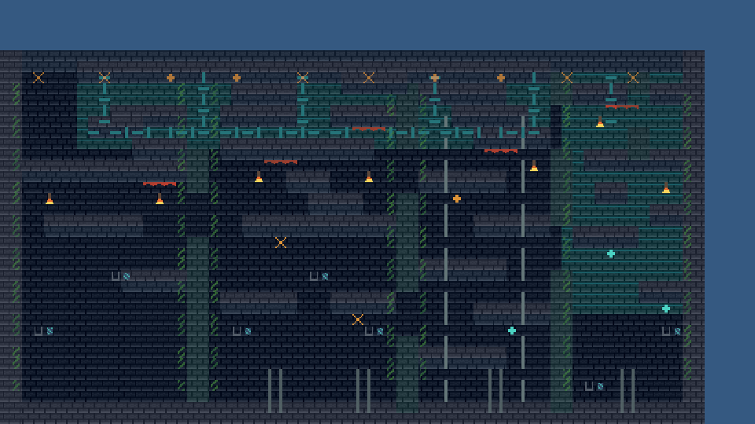

# 原创横版地牢 Tilemap 展示夹具

这是用于 Kadath Tilemap 产品展示的原创 Tiled 1.12 无限地图，不含任何第三方游戏资产。

- 地图范围：64×34 格，世界 X 从 -8 开始；
- Chunk：跨越 X=-32/0/32 与 Y=0/32，共 6 个空间块；
- 视觉层：远景、地形、建筑与机关、前景剪影，共 4 层；
- TileSource：地形与透明装饰两套 8×8 atlas，共 128 个 tile；
- 场景：入口牢房、中央大厅、钟楼竖井、熔炉、下水道、断桥和出口升降机；
- GameplayMarkers Object Layer 会被当前视觉导入器诊断但不会静默进入 Runtime authority。

## Runtime 产品截图

